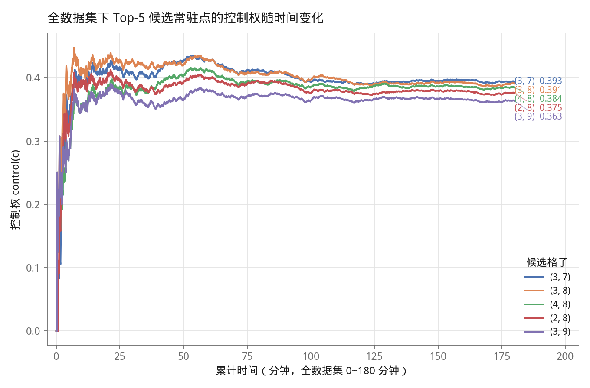
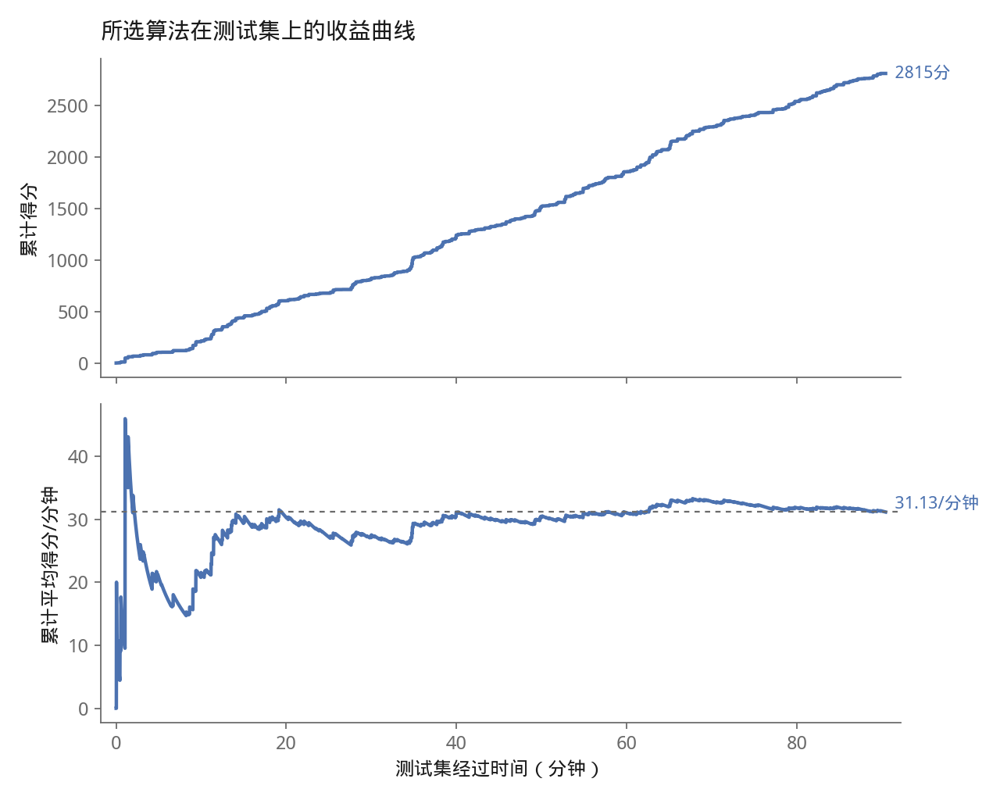

# 符号与数据说明

## 附件数据集原始字段

| 名称 | 含义 |
|---|---|
| 出现时刻 $t$ | 食饵出现的绝对时刻，单位秒，数据集覆盖 $[0, 10800]$ 秒（3小时） |
| 位置 $(x,y)$ | 食饵出现的网格交点坐标，$x,y \in \{1,\dots,10\}$ |
| 分值 $v$ | 食饵的分值，取值范围 $[1,40]$ 的整数 |
| $N=1787$ | 数据集中食饵记录总数 |

## 数据集划分

| 名称 | 含义 |
|---|---|
| 训练集 | 按出现时刻排序后的前 893 条记录，约覆盖前 90 分钟；用于估计一切统计量 |
| 测试集 | 排序后剩余的 894 条记录，约覆盖后 90 分钟；只用于最终评估，从不参与建模 |
| 理论满分 | 某评估区间内全部食饵分值之和，即"假设全部被捕获"能拿到的分数上限 |

## 空间先验统计量

| 名称 | 含义 |
|---|---|
| $p(c)$ | 格子 $c$ 的出现概率：该格子历史出现食饵次数 ÷ 已观测食饵总数 |
| $\text{control}(c)$ | 格子 $c$ 的"控制权"：以 $c$ 为中心、曼哈顿距离 $\le 3$ 邻域内 $p(c')$ 之和 |
| $R=3$ | 控制权邻域半径，取值由题目物理约束决定：食饵存活 3 秒 × 机器人速度 1 米/秒 |
| home | 常驻格：全场 $\text{control}(c)$ 最大的格子（$\arg\max$），训练集起步、运行阶段持续在线更新 |
| $\text{path\_score}(a,b)$ | 从格子 $a$ 到 $b$ 的所有最短（单调）路径中，路径上 $\text{control}(c)$ 之和的最大值；仅用于追逐目标并列时的最后一级判定 |

## 决策规则中的量

| 名称 | 含义 |
|---|---|
| $d(a,b)$ | 格子 $a,b$ 间的曼哈顿距离 |
| 剩余存活时间 | 某食饵的 "出现时刻 + 3 − 当前时刻"，即还剩多久消失 |
| 可达 | $d(\text{机器人位置}, \text{食饵位置}) \le$ 该食饵剩余存活时间 |

## 评估指标（黑箱协议输出）

| 名称 | 含义 |
|---|---|
| appeared | 评估区间内出现的食饵总数 |
| collected | 被机器人成功捕获的食饵数 |
| catch\_rate | 捕获率 = collected / appeared |
| score | 累计得分 |
| minutes | 评估时长（分钟） |
| score\_per\_min | 平均每分钟得分 = score / minutes，即任务三所求的量 |

---

# 任务二：机器人场地竞赛策略设计

## 一、总体框架

**关于起始位置的假设**：题目并未规定比赛开始时机器人所处的格子。真实的机器人竞赛通常允许选手在计时开始前有一段自由的准备时间——机器人可以在这段时间内走到场地内任意一点，这段时间不计入比赛时长也不产生得分。因此本文统一采用这一假设：机器人可以自由选择比赛正式开始时的初始格，而非任意指定为角点 (1,1) 或中心 (5,5) 这类与策略本身无关的位置。在此假设下，"自由选择"的最优结果是显然的——直接选在下文即将给出的常驻格 home 上，这样比赛一开始就已经处于全场控制权最高的位置，无需再花时间从别处走过去。下文所有关于策略框架、伪代码与任务三的评估结果，机器人的初始位置均取为 home。

机器人在任意时刻处于两种模式之一：

- **追逐模式**：视野内（曼哈顿距离内、消失前仍可赶到）存在食饵时，前往其中最优的一个；
- **待机模式**：视野内无可捕获食饵时，沿"局部贪心"规则移动，为下一次食饵出现占据最有利的位置。

两种模式共享同一张底层地图——**控制权分布**，它既决定"待机时该往哪走"，也用于追逐时的并列决胜。整个策略只依赖这一张地图和两条简单规则，不含任何额外的调节参数。

## 二、空间先验：控制权与常驻格

### 2.1 定义

对网格上任意格子 $c$，定义其**控制权**为：

$$\text{control}(c) = \sum_{c': d(c,c') \le 3} p(c')$$

其中 $d(\cdot,\cdot)$ 为曼哈顿距离，$p(c')$ 为格子 $c'$ 出现食饵的经验概率（历史出现次数 / 历史食饵总数）。半径取 3，并非任意选择，而是与题目设定直接对应：食饵停留 3 秒、机器人速度 1 米/秒，二者共同决定了"以当前格子为圆心、曼哈顿半径 3 以内"恰好是机器人原地不动也能在食饵消失前赶到的全部范围——即"控制权"的物理含义就是"如果我现在守在这里，下一个食饵出现时我来得及吃到它的概率"。

**常驻格**（记为 home）定义为控制权最大的格子：$\text{home} = \arg\max_c \text{control}(c)$。

### 2.2 常驻格的计算方式：训练集起步 + 运行阶段在线更新

$p(c')$ 并非一次性算好后固定不变，而是：

1. **训练阶段**：用历史数据集的前 893 条食饵记录（约占全部 1787 条的一半，覆盖约前 90 分钟）统计出初始的 $p(c')$ 与常驻格；
2. **运行阶段**：此后每当机器人观测到一个新的食饵（无论是否捕获成功），立即将其计入统计，重新计算 $p(c')$ 与常驻格——即持续在线更新，而不是训练完就冻结。

这一设计的依据来自对数据集本身规律的验证：食饵出现的空间分布被严格证明与时间无关（前后半程栅格分布相关系数 $r=0.86$；分段列联表卡方检验在 3/6/12 段粒度下 $p=0.50\sim0.75$，均不能拒绝"空间分布随时间平稳"这一假设）。既然分布本身是平稳的，用"历史全部已知数据"去估计它就是合理且样本量越大越准的，不需要按时间分段单独建模。

用全部 1787 条数据统计出的控制权分布中，常驻格为 **(3,7)**，控制权 0.3934；次优候选 (3,8)=0.3906、(4,8)=0.3844、(2,8)=0.3755 彼此非常接近，说明该区域是一个平缓的峰而非尖锐的孤立点。仅用 893 条训练数据即可估出与全量数据几乎一致的常驻格位置（(3,8)，与真实最优点仅差 1 格、控制权仅差 0.7%），说明该空间先验对训练样本量不敏感、收敛很快。



*图：将全部 1787 条数据按出现时刻累计代入统计，Top-5 候选格子的控制权随累计数据量增长而收敛的过程。可以看到各候选点在数据量很小时剧烈震荡、彼此排名不稳定，但在约 25~50 分钟的累计数据后就基本收敛到各自的稳定值，此后名次不再变化——(3,7) 与 (3,8) 全程紧咬，最终差距仅 0.7%。*

## 三、决策规则

### 3.1 追逐规则（视野内存在可达食饵时）

某一时刻，若存在食饵满足"曼哈顿距离 ≤ 剩余存活时间"（即机器人现在出发、匀速直线仍能在其消失前到达），则称其"可达"。在全部可达食饵中，按以下优先级选择目标：

1. **分值最高者优先**——食饵一旦可达就必然值得去，不设任何"分值太低不值得追"的门槛：追逐可达食饵本身不消耗额外机会成本（机器人很快会回到高控制权区域），设置门槛只会白白放弃唾手可得的分数；
2. 若分值并列，选**距离最近**的；
3. 若仍并列，选**沿途控制权之和最大**的（即路径经过的格子控制权总和最高，用于在极少数完全对称的情形下打破平局）。

机器人每秒重新评估一次目标，因此天然支持两种行为，无需额外编码：

- **中途改道**：追逐途中若出现分值更高的新食饵，下一秒的重新评估会自动将其识别为新的最优目标并转向；
- **顺路捎带**：若某个暂不是"最优目标"的食饵恰好在机器人当前必经的路径格子上，机器人经过时会自动拾取，不会因为它"不是本轮选中的目标"而放弃唾手可得的分数。

### 3.2 待机规则：局部贪心

无可达食饵时，机器人朝常驻格方向移动，每一步只在**朝常驻格方向、能减少曼哈顿距离的 1~2 个相邻格**中，选择控制权更高的一个：

$$\text{next} = \arg\max_{c' \in N(\text{pos})} \text{control}(c'), \quad N(\text{pos}) = \{\text{沿 x 方向前进一步}, \text{沿 y 方向前进一步}\} \cap \{\text{朝常驻格方向}\}$$

这是一个纯粹的一步贪心（爬坡）规则，不做路径搜索。之所以能够简化到这一步，是因为可以证明：把"待机路径选择"表述为"整条路径的控制权加权和最大化"时，由于网格上任意两点间的单调路径都可以自由调整先走哪一维，几乎所有"值得经过"的格子在两种首步选择下都同样可达，只是早一步或晚一步经过——在真实数据上，完整路径搜索与一步贪心给出了完全相同的移动序列（在 474 次存在真实方向分支的待机决策上逐条核对，选择结果无一例外一致）。既然结果等价，一步贪心是计算量小得多、同样最优的实现方式。

## 四、算法伪代码

```
初始化：用训练集前893条计算 control(·)，home = argmax control
pos ← home   # 自由准备时间内已提前走到常驻格
每个整数时刻 t:
    将本秒新出现的食饵计入统计，更新 control(·) 与 home
    reachable ← {t时刻可达的食饵}
    若 reachable 非空:
        target ← reachable 中按 (分值desc, 距离asc, 路径控制权desc) 排序后的第一个
        pos ← 朝 target 方向走一步
    否则:
        pos ← 在朝 home 方向的候选相邻格中，选 control(·) 更高的一个
    若 pos 上有存活的食饵: 记分，移除该食饵
```

整个策略只有"控制权地图"这一张统计量和上述两条规则，没有任何需要手工调节的自由参数——这既是它最简单的地方，也是经反复验证后确认为最优的地方：额外增加的门槛、折扣、加权、分区/分时段等机制，在训练集上都没有带来可靠的提升。

---

# 任务三：策略平均每分钟得分估算

## 一、评估方法

为避免"用同一批数据既调参又汇报成绩"造成的虚高，采用严格的训练/测试集划分：数据集按出现时刻排序后，**前 893 条作为训练集，后 894 条作为测试集**，策略的空间先验只在训练集上起步，最终得分完全由测试集上的实测表现给出，测试期间常驻格持续在线更新（用训练集统计量起步，逐条并入测试集新观测），但从未提前使用任何测试集事件的信息。按照一、中说明的起始位置假设，机器人在测试计时开始时即已处于训练集算出的常驻格（(3,8)）。

评估通过黑箱协议进行：策略进程只能实时接收"当前秒 + 新出现食饵的位置与分值"，只能实时输出"下一步移动方向"，与真实比赛机器人能获得的信息完全对等；环境侧独立判定到达边界、食饵是否在 3 秒窗口内被拾取、计分等规则。

## 二、结果

| 评估口径 | 事件数 | 时长 | 理论满分 | 实际得分 | 捕获率 | **平均每分钟得分** |
|---|---|---|---|---|---|---|
| **样本外测试**（训练集起步，测试集从未参与建模） | 894 | 90.4 分钟 | 7764 | 2815 | 37.4%（334/894） | **31.13** |
| **全量部署估计**（用全部 1787 条历史数据训练，评估同一批数据，代表实际部署时可用的全部历史信息量下的预期表现） | 1787 | 180.0 分钟 | 15619 | 6073 | 38.7%（692/1787） | **33.74** |

样本外测试给出的 31.13 分/分钟是不依赖任何"偷看测试数据"的保守估计；全量部署估计的 33.74 分/分钟代表当机器人真正投入使用、能够利用全部已积累历史数据（而不是被人为砍掉一半）建立空间先验时的预期水平——两者相差约 8.4%，差距不大，说明该策略的样本外泛化能力稳健，没有对训练数据产生明显过拟合。



*图：策略在测试集（894 条、90.4 分钟）上的累计得分（上）与累计平均得分/分钟（下）。初期因样本少、常驻格尚未完全稳定，速率有较大波动，约 15 分钟后逐渐收敛并稳定在最终的 31.13 分/分钟附近。*

**结论：该策略在真实竞赛环境中，预期平均每分钟可获得约 31~34 分。**

作为参照，捕获率（37.4%~38.7%）与常驻格自身的控制权（0.3934，即"机器人钉死在常驻格不动"这一理论上限对应的期望捕获比例）非常接近，说明策略的执行效率已经逼近"控制权覆盖"这一理论框架本身能达到的上限。
